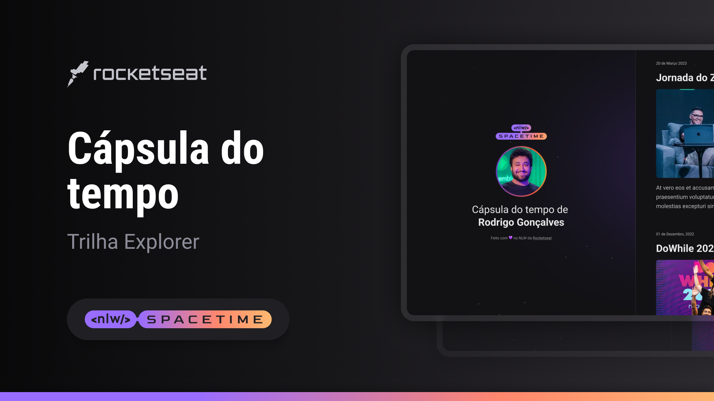

## 🖥️ Projeto
Esse é um projeto Web Responsivo de uma cápsula do tempo para exibir memória em uma linha do tempo.

## 🚀 Tecnologia
Esse projeto foi desenvolvido durante o NLW da Roket Seat com as seguintes tecnologias:

- HTML
- CSS
- Git e GitHub

## 🏷️ Layout
Você pode visualizar o layout do projeto através [desse link](https://www.figma.com/file/5ZNmT3MkZ6jyWGnJXZJmIc/C%C3%A1psula-do-tempo-%E2%80%A2-Trilha-Explorer---Ruan-Guedes?type=design&node-id=306%3A3&t=AS1Olm3rIcxlPS9n-1).
É necessário ter uma conta no [Figma](https://www.figma.com).